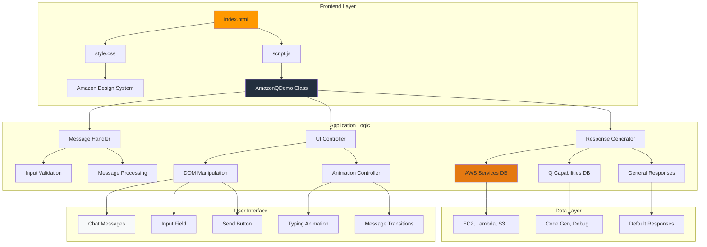
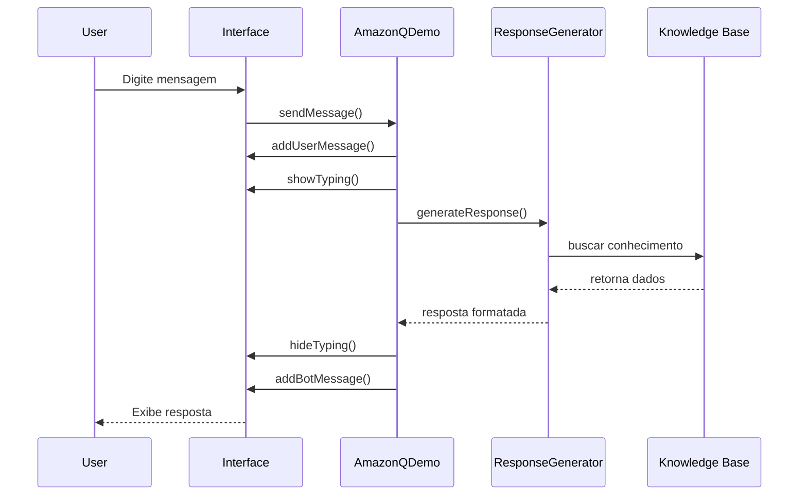
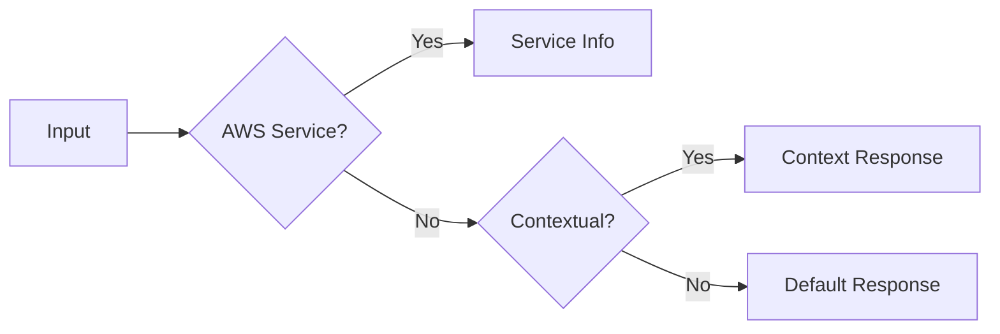

# 🏗️ Arquitetura do Sistema

> **Amazon Q Developer Chatbot Demo** - Documentação técnica da arquitetura

[](https://github.com/seu-usuario/amazon-q-chatbot-demo)
[](architecture.md)

---

## 📊 Diagrama de Arquitetura



---

## 🔄 Fluxo de Dados



---

## 🧩 Componentes Principais

### 🎯 **AmazonQDemo Class**
```javascript
class AmazonQDemo {
  constructor() {
    this.messagesContainer = document.getElementById('messages');
    this.awsServices = { /* 20+ serviços */ };
  }
}
```
- 🎮 Controlador principal da aplicação
- 📊 Gerencia eventos e estado
- 🔧 Inicializa componentes

### 📚 **Knowledge Base**
| Categoria | Descrição | Quantidade |
|-----------|-----------|------------|
| `awsServices` | Serviços AWS (EC2, Lambda, S3...) | 20+ |
| `amazonQCapabilities` | Funcionalidades do Q Developer | 7 |
| `generalResponses` | Respostas contextuais | 5+ |

### 🎨 **UI Components**
- 💬 **Chat Container**: Área de mensagens com scroll automático
- ⌨️ **Input Field**: Campo de entrada com validação
- ⏳ **Typing Indicator**: Animação de "digitando..."
- 💭 **Message Bubbles**: Balões responsivos para usuário/bot

### 🧠 **Response Engine**

- 🔍 Pattern matching por keywords
- 🎯 Fallback para resposta padrão
- 📝 Formatação markdown → HTML

---

## 📁 Estrutura de Arquivos

```
Workshop/
├── 📄 index.html          # Estrutura HTML
├── 🎨 style.css           # Estilos Amazon
├── ⚡ script.js           # Lógica principal
├── 📊 architecture.md     # Este arquivo
├── 📦 package.json        # Configuração
├── 📖 README.md           # Documentação
└── 🧪 tests/
    ├── chatbot.test.js    # Testes automatizados
    └── test-runner.html   # Interface de testes
```

---

## 🚀 Tecnologias Utilizadas

| Tecnologia | Versão | Uso |
|------------|--------|-----|
|  | 5 | Estrutura |
|  | 3 | Estilos |
|  | ES6+ | Lógica |
|  | Latest | Diagramas |

---

## 🎯 Padrões de Design

### 🏛️ **Arquitetura MVC Simplificada**
- **Model**: Knowledge Base (dados)
- **View**: DOM Elements (interface)
- **Controller**: AmazonQDemo Class (lógica)

### 🔄 **Event-Driven Architecture**
- Eventos de click/keypress
- Callbacks assíncronos
- Animações baseadas em estado

### 📱 **Responsive Design**
- Mobile-first approach
- Flexbox layout
- Media queries para breakpoints

---

## 🔧 Como Contribuir

1. **Fork** este repositório
2. **Clone** localmente
3. **Modifique** a arquitetura conforme necessário
4. **Teste** com `npm test`
5. **Documente** mudanças neste arquivo
6. **Pull Request** com descrição detalhada

---

<div align="center">

**🇧🇷 Feito com ❤️ para o TDC São Paulo 2025**

[](https://aws.amazon.com)
[](https://aws.amazon.com/q/)

</div>