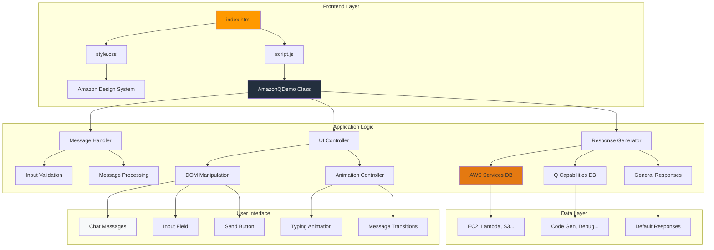
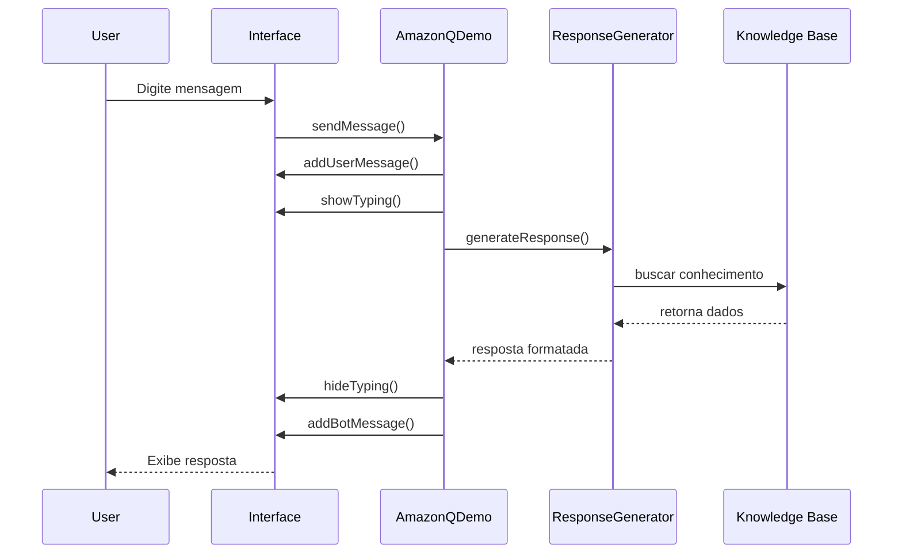

# 🏗️ Arquitetura do Sistema

## Diagrama de Arquitetura

## Fluxo de Dados

## Componentes Principais

### 1. **AmazonQDemo Class**
- Controlador principal da aplicação
- Gerencia eventos e estado

### 2. **Knowledge Base**
- `awsServices`: 20+ serviços AWS
- `amazonQCapabilities`: Funcionalidades do Q
- `generalResponses`: Respostas contextuais

### 3. **UI Components**
- Chat container com scroll
- Input field com validação
- Typing indicator animado
- Message bubbles responsivas

### 4. **Response Engine**
- Pattern matching por keywords
- Fallback para resposta padrão
- Formatação markdown para HTML